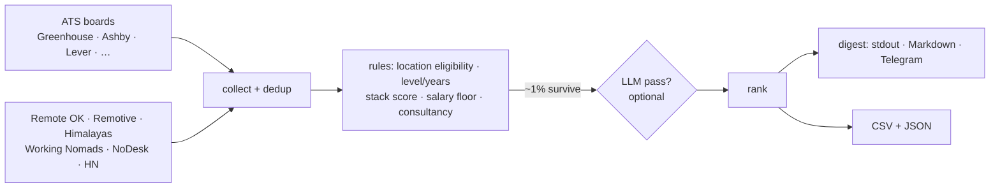

# remote-jobs-digest

**Stop refreshing ten job boards. Get one daily digest of the remote roles you can actually get.**

[](https://github.com/arnaugonzalez/remote-jobs-digest/actions/workflows/ci.yml)


<!-- demo.gif: `rjs run --no-ai` ending on the digest (record with vhs, ≤20 s) -->

"Remote" on a job board often means *remote, if you live in California*. rjs reads the whole
posting and keeps the ones that fit **where you live**, the years you have, your stack and your salary
floor. It pulls from public company career pages (Greenhouse, Ashby, Lever…) and remote job APIs,
drops 99 % of the noise with plain rules at zero cost, and optionally asks an LLM about the few
dozen survivors.

## Quickstart

```bash
pipx install remote-jobs-digest          # or: uv tool install remote-jobs-digest
rjs init                                 # 13 questions, or: rjs init --from backend-ai-eu
rjs run --no-ai                          # prints today's digest, no API keys needed
```

A first run takes under a minute. It prints a summary and the digest, and writes a CSV, a JSON and
`digest_latest.md` to the data dir (`rjs paths` shows where).

```
💼 Remote jobs digest — 9 match, 🆕 9 new (out of 4853 collected)
🚫 173 management/staff+ · 🏢 4 consultancy · ⚠️ 44 to review

1. 🆕 Frontend Web Application Developer — KoboToolbox
   [UNKNOWN · stack 3/10] · 💰 90,000–105,000 USD
   https://remotive.com/remote-jobs/... (via Remotive)
```

To cover more companies, build the list of company ATS boards once (about 10 minutes, all public APIs):

```bash
rjs boards build --fetch     # ~1,100 remote-friendly companies from public GitHub lists
rjs boards discover          # finds their Greenhouse/Ashby/Lever/... boards (~500)
```

## Why this and not…

| Instead of… | Use that when | Use rjs when |
|---|---|---|
| [career-ops](https://github.com/career-ops-hq/career-ops) | You want the whole funnel inside an AI coding CLI: evaluation reports, tailored CVs, tracking, negotiation. It is far more complete. | You only want to **find** the jobs, every morning from cron, without spending tokens on each posting. rjs spends none unless you enable the LLM, and only on survivors. |
| [JobSpy](https://github.com/speedyapply/JobSpy) | You want raw rows from LinkedIn/Indeed/Glassdoor in a DataFrame. | You want them **filtered**: rjs adds location eligibility, years, stack, salary and consultancy rules on top. It can use JobSpy as an optional source. |
| LinkedIn / Remotive / Himalayas alerts | Keyword alerts are good enough. | You keep getting "Remote (US only)", "Senior Staff, 10+ years" or agency reposts. |

## How it works



1. **Location eligibility** uses roles, not a country list: *home* (where you live: onsite, hybrid
   and remote all fine), *region* (e.g. EMEA, LATAM), *away* (other countries in your region:
   remote only), *blocked*. "Remote" with no scope, or "Remote — LATAM" for a Europe-based user,
   goes to **REVIEW**, never straight to MATCH.
2. **Level** comes from what the posting asks, not the title: "Senior Engineer, 3+ years" is mid;
   "Engineer, 8+ years" is not.
3. **Stack** is a weighted table: *strong* words count anywhere, *weak* words ("python", "cloud")
   only in the title or tags, so a job does not score 10/10 because the company blog mentions AWS.
4. **Salary** floors per currency. Unknown currencies are flagged, not assumed to be USD.
5. The optional **LLM** reads the full description of the survivors and returns real level, fit 0–10,
   workload and a one-line reason. Its instructions are generated from your profile.

## Configuration

`rjs init` writes `~/.config/rjs/config.yaml`. Everything the filter uses is in that file;
`rjs config show` prints the effective values and `rjs config check` validates edits.
Bundled examples (`rjs init --list-examples`): [`backend-ai-eu`](src/remote_jobs_digest/examples/backend-ai-eu.yaml), [`frontend-latam`](src/remote_jobs_digest/examples/frontend-latam.yaml).

| Key | What it does |
|---|---|
| `geo.home_hints` / `region_hints` / `away_hints` / `blocked_hints` | Location roles described above |
| `geo.accept_modes` | `remote`, `hybrid`, `onsite` |
| `experience.ideal_min` / `ideal_max` / `stretch` / `max_required` | Years band: ideal → MATCH, stretch → REVIEW, above max → rejected |
| `stack.weighted` | `[{weight, label, strong: [...], weak: [...]}]` |
| `stack.required` | Hard AND: words that must appear |
| `salary.floor` | `{EUR: 40000, USD: 60000}` |
| `company.kind` | `product`, `any` or `consultancy` |
| `company.consulting_companies` | Consultancies to drop. The package ships none: your call |
| `company.staffing_platforms` | Talent marketplaces (Toptal, Upwork, Lemon.io…) whose posts are templates; a default list ships |
| `signals.negative` | Phrases that reject a job ("must reside in the US", "security clearance"…) |
| `search.active_sources` | Which sources run |
| `narrative` or `~/.config/rjs/profile.md` | Free text about you, read by the LLM |

Keys you leave out take built-in defaults (the `backend-ai-eu` example), so check
`rjs config show` after editing by hand.

Environment variables (`~/.config/rjs/.env` works too): see [`.env.example`](.env.example).
The LLM pass takes any **OpenAI-compatible** endpoint: `RJS_LLM_BASE_URL`, `RJS_LLM_API_KEY`,
`RJS_LLM_MODEL` (Groq by default; OpenAI, OpenRouter, Gemini, Ollama and LM Studio work).
Telegram: `TELEGRAM_BOT_TOKEN` + `TELEGRAM_CHAT_ID`.

### Running it daily

`rjs run` is idempotent and remembers what it already showed you (🆕 marks new jobs).
Pick one: [cron](deploy/crontab.example), a [systemd user timer](deploy/rjs.timer), or a
[GitHub Actions schedule](deploy/github-actions-digest.yml) in a private repo (no server).

## Sources, ethics and terms of service

| Source | Access | Default |
|---|---|---|
| Company ATS boards (Greenhouse, Ashby, Lever, SmartRecruiters, Recruitee, Breezy, Workable, Personio) | Public job-board APIs meant for embedding | on |
| Remote OK, Remotive, Himalayas | Public APIs; **attribution required**: every digest line says "via …" and links to the original | on |
| Working Nomads, NoDesk, HN "Who is hiring" | Public API / RSS / Algolia API | on |
| We Work Remotely | RSS; applying needs a paid account | off |
| LinkedIn (guest endpoint), Indeed / Glassdoor / Google (via JobSpy), Built In | Scraping; their terms forbid automated access | **off**: opt in via `search.active_sources`, your IP and your call |

Please keep the defaults polite: Remotive asks for at most ~4 requests a day and Himalayas caches for
24 h, so one run a day is plenty. The digest is for you; do not republish it as a job board.

## The `apply` extra (supervised pilot)

`pip install 'remote-jobs-digest[apply]'` adds tools the author uses after the digest: dossiers
with a draft cover letter (`rjs apply`), LLM re-verification of full postings (`rjs verify`),
screening-question drafts (`rjs answer`), ATS form pre-fill in a real browser that **stops before
submit** (`rjs fill`), cold-email **drafts** (`rjs outreach`) and inbox triage (`rjs gmail`).
Personal data lives in `~/.config/rjs/identity.yaml`. Nothing is sent or submitted for you. These
tools are less polished than the core, their prompts and messages are still partly in Spanish, and
automating applications can break job sites' terms. Use them as drafts.

## Limits and non-goals

- Not an auto-apply bot, and it will not become one.
- Without the LLM pass, stack scoring is keyword-based and coarse: a Python job that mentions
  Kubernetes can reach a Go profile. The LLM pass, or a finer `stack.weighted` table, fixes most of it.
- The rules are tuned for software roles; other fields need your own stack table and signals.
- Location matching is text matching. Unusual phrasings end up in REVIEW, which is the point.
- Code comments and some logs are in Spanish; the CLI and docs are English. PRs welcome.
- Linux and macOS. Windows is untested.

## Roadmap

- `--export career-ops` to feed its pipeline.
- Labelled golden sets per example profile, with precision/recall in CI.
- More notification targets (Slack, email) via [apprise](https://github.com/caronc/apprise).

## License

MIT. Job data belongs to the sources and employers; respect their terms.
